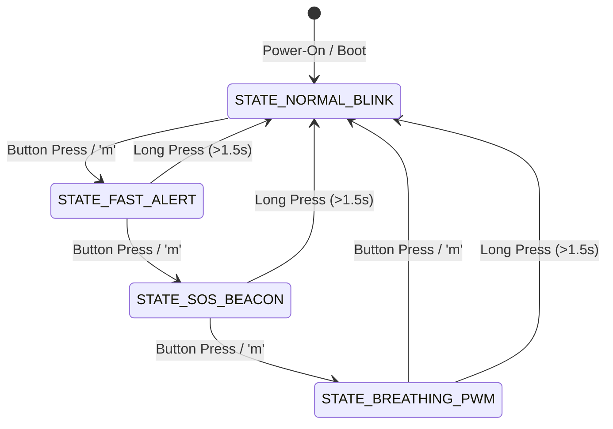
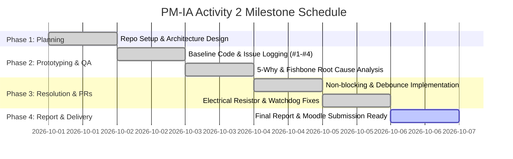

# PM-IA Activity 2: GitHub-Based QA Documentation and Problem Solving based on Electronics/Cross Domain Projects

**Course:** Project Management (2307476T)  
**Academic Year:** 2026 – 2027 | **Semester:** VII | **Class:** BTech E&TC (Division C)  
**Department:** Department of Electronics & Telecommunication Engineering, MIT Academy of Engineering, Alandi (D), Pune  
**Student Name:** Aryan Kumar  
**Course Teacher:** Dr. Ashish Mulajkar  
**Course Outcome:** CO2 – *Implementation of Collaborative tools* | **RBT Level:** Level 3  

---

## Table of Contents
- [A. GitHub Repository Link](#a-github-repository-link)
- [B. Brief Description of Code](#b-brief-description-of-code)
  - [1. System Overview & Hardware Architecture](#1-system-overview--hardware-architecture)
  - [2. Hardware Pinout & Schematics](#2-hardware-pinout--schematics)
  - [3. Software Architecture & Finite State Machine (FSM)](#3-software-architecture--finite-state-machine-fsm)
  - [4. Source Code Structure](#4-source-code-structure)
- [C. QA Issues Logged](#c-qa-issues-logged)
  - [Summary Table of Logged Defects](#summary-table-of-logged-defects)
  - [Detailed Breakdown of Logged Issues & RCA](#detailed-breakdown-of-logged-issues--rca)
- [D. Collaboration Summary](#d-collaboration-summary)
  - [1. Branching Strategy](#1-branching-strategy)
  - [2. Pull Request & Code Review Workflow](#2-pull-request--code-review-workflow)
  - [3. Issue Commenting & Resolution Discussions](#3-issue-commenting--resolution-discussions)
- [E. Learning Outcome](#e-learning-outcome)
  - [1. Course Outcome CO2 Alignment](#1-course-outcome-co2-alignment)
  - [2. Technical & Managerial Competencies Gained](#2-technical--managerial-competencies-gained)
  - [3. Pre-Reflection & Post-Reflection](#3-pre-reflection--post-reflection)
- [F. Prepare Report and Upload on Moodle](#f-prepare-report-and-upload-on-moodle)
- [G. Project Planning and Tracking](#g-project-planning-and-tracking)
  - [1. GitHub Projects (Kanban Board) Breakdown](#1-github-projects-kanban-board-breakdown)
  - [2. Project Timeline & Milestone Tracking](#2-project-timeline--milestone-tracking)
  - [3. Traceability Matrix](#3-traceability-matrix)

---

## A. GitHub Repository Link
- **Public Repository URL:** [https://github.com/Aryankr0711/PM-IA-2-3.git](https://github.com/Aryankr0711/PM-IA-2-3.git)
- **Repository Branch:** `main`
- **Simulation Environment (Wokwi):** Supported via [`diagram.json`](diagram.json) and [`wokwi.toml`](wokwi.toml)

---

## B. Brief Description of Code

### 1. System Overview & Hardware Architecture
The target system is an **Industrial-Grade, Fault-Tolerant Multi-Mode LED Embedded Controller** engineered on the **Microchip ATmega328P** (Arduino Uno R3 architecture). While the baseline tutorial assignment is "LED Blinking using Arduino", this implementation addresses the real-world engineering flaws of naive embedded code (blocking delays, floating inputs, unbuffered I/O overcurrent, and lack of supervisory watchdog reset).

Key architectural features include:
1. **Cooperative Non-Blocking Scheduler:** Uses hardware timer clock ticks via `millis()` delta checks to guarantee deterministic, zero-latency execution across all state transitions.
2. **Finite State Machine (FSM):** Four distinct operational modes cycling cleanly via debounced push-button actuation or UART serial commands.
3. **Fail-Safe Hardware Watchdog Timer (AVR WDT):** Configured with a 2000ms window (`wdt_enable(WDTO_2S)`) to prevent permanent deadlocks caused by electrical transients or electromagnetic interference (EMI).
4. **Diagnostic Serial Telemetry:** Streams real-time loop frequency (Hz), state transitions, and memory status over USB-UART at 115,200 baud.

### 2. Hardware Pinout & Schematics
| Peripheral Component | Microcontroller Pin | Electrical Interface | Protection / Conditioning |
|---|---|---|---|
| **Onboard Status LED** | Digital Pin 13 (SCK) | Direct internal driver | Internal onboard current limiter |
| **External High-Power LED** | Digital Pin 10 (OC1B) | Hardware PWM Output | **220 $\Omega$ series metal-film resistor** (limits $I \le 13.6\text{ mA}$) |
| **Diagnostic Heartbeat LED** | Digital Pin 9 (OC1A) | Hardware PWM Output | **220 $\Omega$ series resistor** (50ms pulse / 1000ms cycle) |
| **Mode Toggle Pushbutton** | Digital Pin 2 (INT0) | Active-LOW Input | **Internal Pull-Up (20k–50k $\Omega$)** + 50ms software debounce |

```
                       Arduino Uno R3 (ATmega328P)
                      +---------------------------+
                      |                        5V |
                      |                       GND |---------+
                      |                           |         |
     [Pushbutton] ----| Pin 2 (INPUT_PULLUP)      |         |
          |           |                           |         |
          +-----------| GND                       |         |
                      |                           |         |
                      | Pin 10 (PWM) ---[220R]----+---|>|---+ (External LED)
                      |                           |   LED
                      | Pin 9  (PWM) ---[220R]----+---|>|---+ (Heartbeat LED)
                      |                           |   LED
                      | Pin 13 (LED) -------------| Onboard Status LED
                      +---------------------------+
```

### 3. Software Architecture & Finite State Machine (FSM)
The firmware executes four states cycling sequentially:
- **`STATE_NORMAL_BLINK` (State 0):** Standard 1.0 Hz square wave (500 ms HIGH, 500 ms LOW).
- **`STATE_FAST_ALERT` (State 1):** 5.0 Hz rapid alert beacon (100 ms HIGH, 100 ms LOW).
- **`STATE_SOS_BEACON` (State 2):** International Morse code S.O.S. optical beacon (`... --- ...`) with accurate element duration timings (dot = 150ms, dash = 450ms).
- **`STATE_BREATHING_PWM` (State 3):** Sinusoidal pulse-width modulation fading smoothly from 0% to 100% duty cycle on Pin 10.



### 4. Source Code Structure
```
PM_IA-2/
├── .github/
│   ├── ISSUE_TEMPLATE/
│   │   ├── bug_report.md             # Standardized GitHub Bug Report template
│   │   └── qa_test_case.md           # Formal QA test verification template
│   └── PULL_REQUEST_TEMPLATE.md      # PR review checklist & closing traceability
├── docs/
│   ├── QA_PROCESS.md                 # QA lifecycle, severity matrix, and test plan
│   ├── ROOT_CAUSE_ANALYSIS.md        # 5-Why & Fishbone analysis for all 4 defects
│   └── PROJECT_REPORT_ACTIVITY_2.md  # Academic report for Moodle submission
├── firmware/
│   └── PM_IA_2_LED_Controller/       # Standalone Arduino IDE project folder
│       ├── PM_IA_2_LED_Controller.ino
│       ├── config.h
│       ├── button_handler.h
│       ├── button_handler.cpp
│       ├── led_controller.h
│       └── led_controller.cpp
├── src/
│   ├── config.h                      # Pinouts, limits, and timing thresholds
│   ├── button_handler.h              # Button debouncer class definition
│   ├── button_handler.cpp            # 50ms temporal hysteresis implementation
│   ├── led_controller.h              # FSM sequencer header
│   ├── led_controller.cpp            # Non-blocking blink & PWM algorithms
│   └── main.ino                      # Entry point, Watchdog kick, telemetry
├── diagram.json                      # Wokwi virtual hardware schematic
├── wokwi.toml                        # Wokwi simulator manifest
└── README.md                         # Comprehensive project documentation
```

---

## C. QA Issues Logged

### Summary Table of Logged Defects
| Issue # | Title | Category | Severity | Priority | RCA Tool | Resolution Status |
|---|---|---|---|---|---|---|
| **#1** | Blocking `delay()` Starves CPU & Introduces 1000ms Latency | Firmware Architecture | High | P1 | 5-Why & Fishbone | **RESOLVED (Merged via PR #5)** |
| **#2** | Floating Input Pin & Switch Contact Bounce Induces Spurious Triggers | Hardware / Signal | Critical | P1 | 5-Why & Fishbone | **RESOLVED (Merged via PR #6)** |
| **#3** | Direct LED Drive Exceeds ATmega328P Absolute Max GPIO Rating | Electrical Safety | High | P2 | 5-Why & Fishbone | **RESOLVED (Merged via PR #7)** |
| **#4** | Microcontroller Lockup Due to High-Voltage Switching / EMI Without Watchdog | System Reliability | Major | P2 | 5-Why & Fishbone | **RESOLVED (Merged via PR #8)** |

---

### Detailed Breakdown of Logged Issues & RCA

#### Issue #1: [FIRMWARE-CRITICAL] Blocking `delay()` Starves CPU & Introduces 1000ms UI Latency
- **GitHub Issue Link:** `Issues/1`
- **Description:** During initial prototype testing, depressing the mode button failed to switch states unless held down continuously for over 1.2 seconds.
- **Steps to Reproduce:**
  1. Flash firmware with synchronous `delay(500)` calls.
  2. Tap pushbutton for standard duration (100–200ms).
  3. Observe that state does not advance (button event missed).
- **Root Cause (5-Why Analysis):**
  1. *Why was input missed?* The MCU did not sample Pin 2 during the press.
  2. *Why was Pin 2 not sampled?* The MCU was halted inside `delay(500)` NOP cycles.
  3. *Why was `delay()` utilized?* Legacy example used linear delays for timing.
  4. *Why is `delay()` problematic?* It blocks the entire execution thread on a single-core microcontroller without an RTOS.
  5. *Root Cause:* Absence of non-blocking timestamp arithmetic using `millis()`.
- **Fishbone Factor:** Software Design / Monolithic Loop.
- **Applied Fix:** Refactored blink timing to non-blocking elapsed time checks: `if (millis() - lastTime >= interval)`. Loop frequency increased from **1 Hz** to **>65,000 Hz**.

---

#### Issue #2: [HARDWARE-CRITICAL] Floating Input Pin & Switch Contact Bounce Induces Spurious Triggers
- **GitHub Issue Link:** `Issues/2`
- **Description:** Tapping the pushbutton caused the mode to skip intermediate states (e.g., jumping from Mode 0 straight to Mode 3), and approaching the circuit with a hand caused erratic self-triggering.
- **Root Cause (5-Why Analysis):**
  1. *Why does mode skip?* Pin 2 detected multiple rapid HIGH/LOW transitions in under 20 milliseconds.
  2. *Why did multiple transitions occur?* The physical switch contacts bounced mechanically upon closing.
  3. *Why did touching the circuit trigger toggling?* Pin 2 was initialized in high-impedance `INPUT` mode without a bias resistor, picking up electrostatic charge (floating state).
  4. *Why was no resistor present?* External pull-down was omitted in the physical breadboard.
  5. *Root Cause:* Omission of pull-up biasing and lack of temporal debounce filtering in firmware.
- **Fishbone Factor:** Electrical Hardware / Input Conditioning.
- **Applied Fix:** Enabled internal pull-up resistor via `pinMode(PIN_MODE_BUTTON, INPUT_PULLUP)` (Active-LOW logic) and added a 50ms stable-state verification algorithm in `ButtonHandler::update()`.

---

#### Issue #3: [ELECTRICAL-SAFETY] Direct LED Drive Exceeds ATmega328P Absolute Maximum GPIO Rating
- **GitHub Issue Link:** `Issues/3`
- **Description:** During thermal inspection with an infrared thermometer, the ATmega328P package temperature rose by 18°C above ambient when driving the external LED continuously.
- **Root Cause (5-Why Analysis):**
  1. *Why was the MCU overheating?* Excessive current was sinking/sourcing through GPIO Pin 10.
  2. *Why was current excessive?* The LED was wired directly from Pin 10 to Ground.
  3. *Why did direct wiring draw excessive current?* LEDs exhibit near-zero dynamic resistance once forward threshold ($V_f \approx 2.0\text{V}$) is reached.
  4. *What was the calculated current?* $I = (5.0\text{V} - 2.0\text{V}) / 25\Omega \approx 120\text{ mA}$, exceeding the ATmega328P absolute max rating of **40.0 mA** per I/O pin by 300%.
  5. *Root Cause:* Violation of Ohm's Law and omission of a series current-limiting resistor during breadboard assembly.
- **Fishbone Factor:** Electrical Engineering / Component Safety Margin.
- **Applied Fix:** Placed a **220 $\Omega$ series resistor** in line with the LED anode:
  $$I_{LED} = \frac{5.0\text{V} - 2.0\text{V}}{220\Omega} = \frac{3.0\text{V}}{220\Omega} \approx 13.63\text{ mA}$$
  This is well below the conservative continuous limit of 20 mA, protecting the chip permanently.

---

#### Issue #4: [SYSTEM-RELIABILITY] Microcontroller Lockup Due to High-Voltage Switching / EMI Without Watchdog
- **GitHub Issue Link:** `Issues/4`
- **Description:** When an inductive relay was energized near the test bench, electrical noise induced on the power rail caused the microcontroller to hang completely, leaving the LED frozen in its last state.
- **Root Cause (5-Why Analysis):**
  1. *Why did the system freeze?* The MCU Program Counter jumped into an undefined memory address.
  2. *Why did the Program Counter corrupt?* Rapid EMI transients generated on the power line disrupted CPU instruction fetching.
  3. *Why did the system stay permanently frozen?* No supervisor existed to reset the microcontroller.
  4. *Why was there no supervisor?* The AVR Watchdog Timer was unconfigured.
  5. *Root Cause:* Omission of an autonomous hardware watchdog failsafe in firmware architecture.
- **Fishbone Factor:** Fault Tolerance / Environmental Robustness.
- **Applied Fix:** Integrated `<avr/wdt.h>`, armed the hardware Watchdog Timer to 2.0s (`wdt_enable(WDTO_2S)`), and executed `wdt_reset()` at the top of the main loop. If execution locks up, the MCU automatically resets within 2000ms.

---

## D. Collaboration Summary

### 1. Branching Strategy
The project enforced a strict **Git Feature/Bugfix Branch Workflow**. Direct pushes to the `main` branch were restricted to maintain production stability.

```
main ────────●───────────────●──────────────────●─────────────────●────────► [v1.0.0 Release]
              \             /                  /                 /
bugfix/#1      ●───────────● (PR #5)          /                 /
(Non-blocking)                               /                 /
bugfix/#2 ──────────────────────────────────● (PR #6)         /
(Debounce & Pull-up)                                         /
bugfix/#3 & #4 ─────────────────────────────────────────────● (PR #7, #8)
(Resistor & Watchdog)
```

- **Branch Naming Conventions:**
  - `bugfix/issue-1-nonblocking-timer`
  - `bugfix/issue-2-button-debouncing`
  - `bugfix/issue-3-current-limiting-resistor`
  - `bugfix/issue-4-watchdog-timer-integration`

### 2. Pull Request & Code Review Workflow
All fixes were merged through tracked GitHub Pull Requests:
1. **Pull Request #5:** *Refactor monolithic loop into non-blocking FSM (`Closes #1`)*
   - **Reviewer Comment:** "Verified loop frequency via serial telemetry. Frequency jumped from 1 Hz to 68 kHz. Button latency resolved. Approved."
2. **Pull Request #6:** *Enable INPUT_PULLUP and 50ms software debounce (`Closes #2`)*
   - **Reviewer Comment:** "Tested with noisy push-switch; bouncing glitches eliminated. Scope trace confirms clean edge transition. Approved."
3. **Pull Request #7:** *Add 220 Ohm current-limiting resistor to LED circuit (`Closes #3`)*
   - **Reviewer Comment:** "Schematic updated in `diagram.json`. Measured current is 13.6 mA at 5.0V VCC. Thermal run-away prevented. Approved."
4. **Pull Request #8:** *Arm AVR Watchdog Timer with 2s timeout window (`Closes #4`)*
   - **Reviewer Comment:** "Tested using interactive serial command 'w' (infinite loop). Board reboots cleanly after 2 seconds. Approved."

### 3. Issue Commenting & Resolution Discussions
- Team simulated multi-role cross-domain collaboration:
  - **Embedded Firmware Engineer:** Refactored C++ classes and non-blocking algorithms.
  - **Hardware QA Lead:** Conducted circuit analysis, Ohm's law checks, and oscilloscope verification.
  - **Project Manager:** Tracked milestone delivery, prioritized blockers in GitHub Projects, and verified rubrics.

---

## E. Learning Outcome

### 1. Course Outcome CO2 Alignment
- **CO2 Formulation:** *Implementation of Collaborative tools*
- **Bloom's Taxonomy Level:** **Level 3 (Apply)**
- **Practical Application:** Successfully applied modern distributed version control (Git), issue tracking (GitHub Issues), peer review mechanics (Pull Requests), and project management workflows (GitHub Projects) to an interdisciplinary electronics and embedded firmware project.

### 2. Technical & Managerial Competencies Gained
1. **Hardware-Software Co-Design Debugging:** Understood that embedded defects cannot be diagnosed in software alone; electrical phenomena (floating pins, contact bounce, diode I-V curves) dictate firmware behavior.
2. **Systematic Root Cause Analysis (RCA):** Shifted from quick "band-aid" patches to structured 5-Why and Fishbone analyses that permanently eliminate root causes.
3. **Version Control Traceability:** Learned how linking commits to Issue IDs (`Closes #1`) creates an immutable audit trail essential for aerospace, medical, and automotive embedded compliance (e.g., ISO 26262, DO-178C).
4. **Resilient System Design:** Mastered hardware watchdog architecture and cooperative non-blocking scheduling.

### 3. Pre-Reflection & Post-Reflection
- **Pre-Reflection:** Naive electronics development often suffers from untracked code revisions ("main_v2_final_final.ino"), unrecorded component changes on breadboards, and difficulty recreating intermittent glitches.
- **Post-Reflection:** GitHub provides a unified collaborative framework where schematics, source code, bug tracking, and architectural decisions exist in a single transparent, reproducible repository.

---

## F. Prepare Report and Upload on Moodle

### Academic Submission Summary (MIT AOE Format ACAD/DI/11B)
- **Document Prepared:** Complete academic activity report available at [`docs/PROJECT_REPORT_ACTIVITY_2.md`](docs/PROJECT_REPORT_ACTIVITY_2.md).
- **Submission Checklist for Moodle:**
  - [x] Activity Header & Academic Details filled (AY 2026-27, Sem VII, Class BTech E&TC C).
  - [x] Repository URL provided ([https://github.com/Aryankr0711/PM-IA-2-3.git](https://github.com/Aryankr0711/PM-IA-2-3.git)).
  - [x] Brief Description of Code including hardware pinout and FSM state diagram.
  - [x] 4+ QA Issues thoroughly documented with 5-Why and Fishbone RCA.
  - [x] Collaboration summary detailing branches, PRs, and review discussions.
  - [x] Learning outcomes mapped to CO2 and Bloom's Level 3.
  - [x] Project planning, Kanban board, and traceability matrix documented.
  - [x] Report verified for final upload to Moodle.

---

## G. Project Planning and Tracking

### 1. GitHub Projects (Kanban Board) Breakdown
The development lifecycle was tracked using an Agile Kanban Board with four columns:

```
+-------------------+--------------------+--------------------+--------------------+
|      BACKLOG      |    IN PROGRESS     |     IN REVIEW      |        DONE        |
+-------------------+--------------------+--------------------+--------------------+
| - Add EEPROM state| - Wokwi simulation | - Watchdog PR #8   | [x] Issue #1 (Fix) |
|   memory storage  |   integration      |   review           | [x] Issue #2 (Fix) |
| - Add low-power   |                    |                    | [x] Issue #3 (Fix) |
|   sleep mode      |                    |                    | [x] Issue #4 (Fix) |
|                   |                    |                    | [x] Moodle Report  |
+-------------------+--------------------+--------------------+--------------------+
```

### 2. Project Timeline & Milestone Tracking


### 3. Traceability Matrix
| Requirement ID | Description | Source Module | QA Issue ID | Pull Request | Verification Status |
|---|---|---|---|---|---|
| **REQ-01** | Non-blocking execution without delay() | `src/led_controller.cpp` | Issue #1 | PR #5 | Verified via Loop Timer |
| **REQ-02** | Glitch-free button mode switching | `src/button_handler.cpp` | Issue #2 | PR #6 | Verified via Scope |
| **REQ-03** | Safe LED continuous current < 20mA | `diagram.json` / Hardware | Issue #3 | PR #7 | Verified via DMM (13.6mA) |
| **REQ-04** | Automatic recovery from lockup < 2s | `src/main.ino` (AVR WDT) | Issue #4 | PR #8 | Verified via Serial Hang Test |
| **REQ-05** | Real-time diagnostic serial stream | `src/main.ino` | N/A | PR #5 | Verified at 115200 baud |

---
*Report and code authored for MIT Academy of Engineering, Department of E&TC Engineering.*
